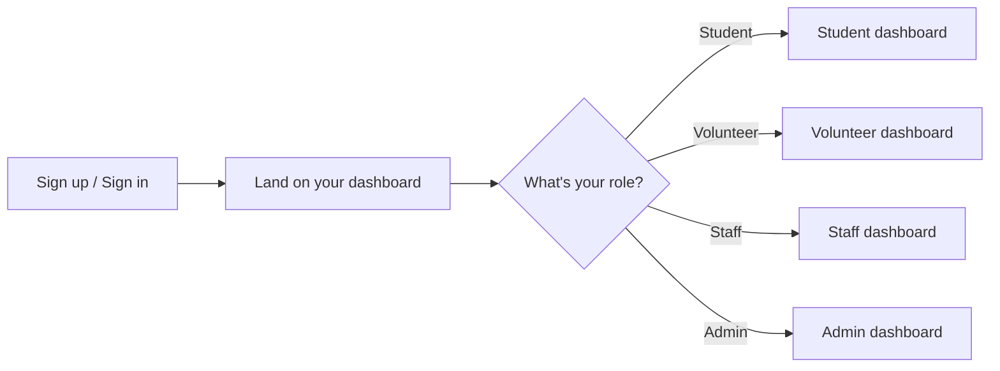
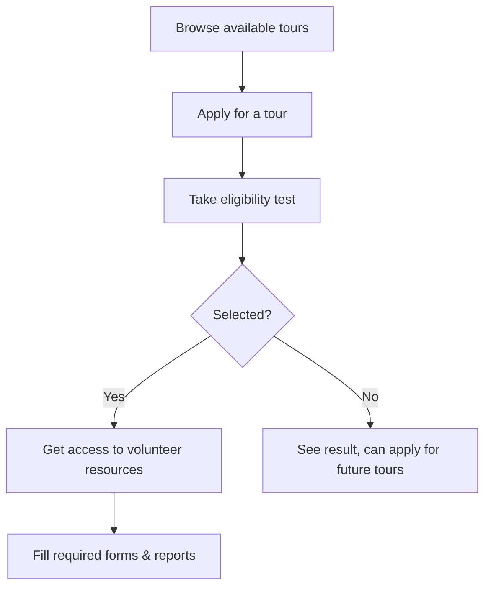
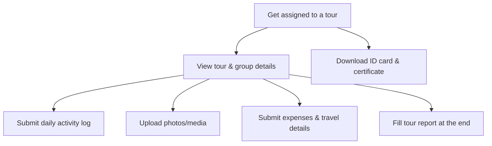
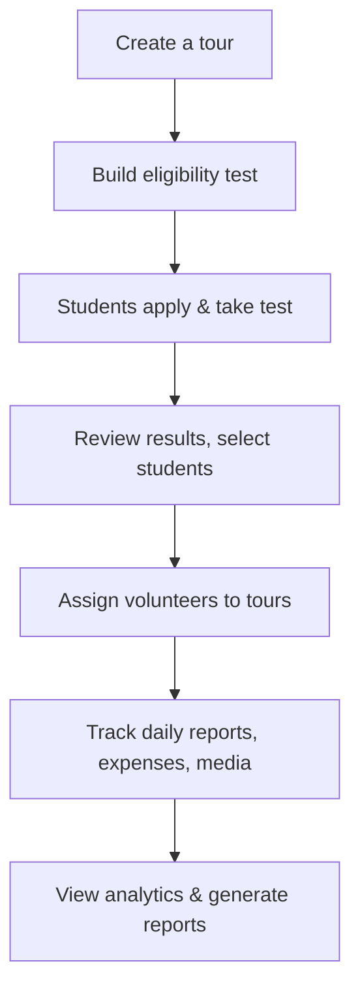
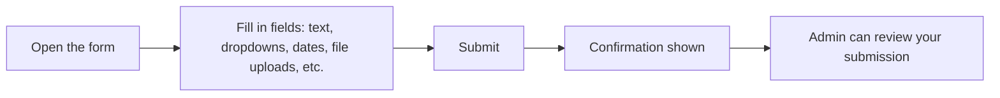
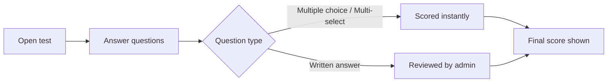

# Gyan Setu — How to Use This Platform

Simple guide for everyone using the platform: students, volunteers, staff, admins.

## Who can do what

| You are... | You can... |
|---|---|
| **Student** | apply for tours, take eligibility tests, fill forms, view your profile & results |
| **Volunteer** | manage assigned tours, log daily reports, submit expenses/travel, upload photos, get certificates |
| **Staff (EARC)** | view programme data, student data, documents |
| **Admin** | manage everything: tours, tests, forms, students, volunteers, finance, reports |
| **Super Admin** | everything admin can, plus assign roles to others |

## Getting started

You only see the pages meant for your role. No setup needed — sign in and you're routed automatically.

## Student journey

- Tests can have multiple-choice, multi-select, or written questions.
- Objective questions are scored instantly. Written answers are checked by admin.
- You'll see your score and status once review is done.

## Volunteer journey

## Admin journey

Super Admin also handles: assigning staff roles, managing who is admin/volunteer/staff.

## Forms — how they work

Any form you see (daily report, application, feedback, etc.) works the same way everywhere:

## Tests — how they work

## Good to know

- All pages are role-protected — you can't accidentally see someone else's dashboard.
- Notifications keep you updated on applications, selections, and deadlines.
- Everything works on mobile and desktop.
